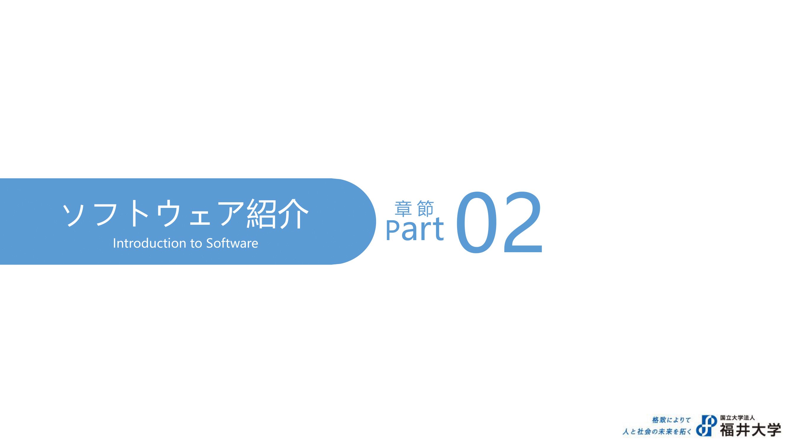
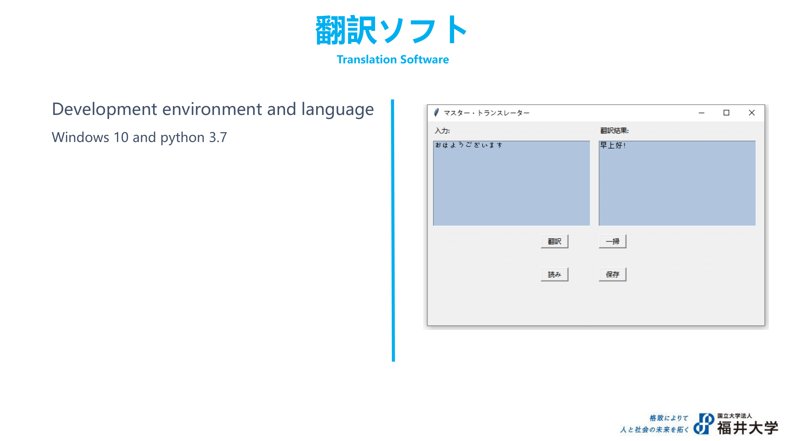

# YE
Translation tool for International Student
It can translate between CN and JP
Based on Youdao translation website.
The expatiation is following the down side
[PBL1.pdf](https://github.com/BenjaminYep/YE/files/8530912/PBL1.pdf)

